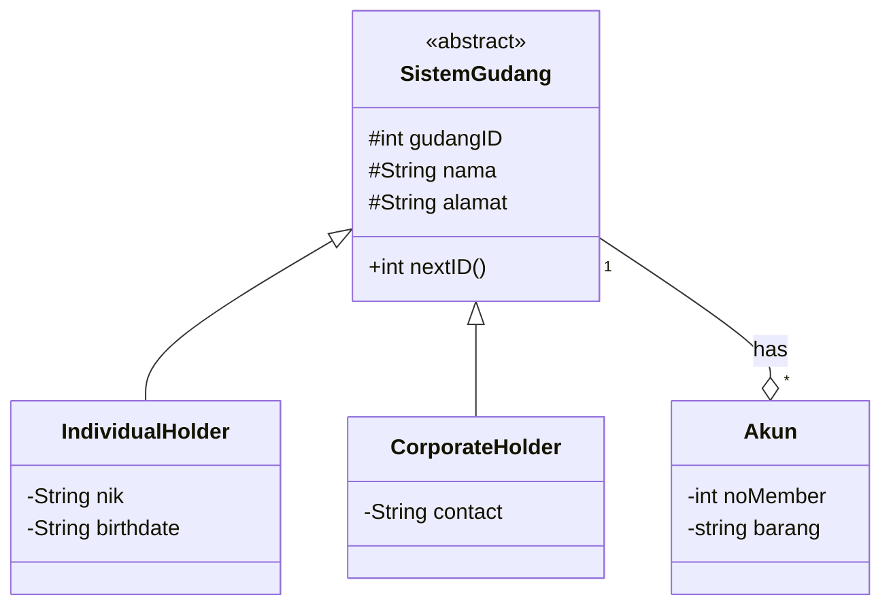
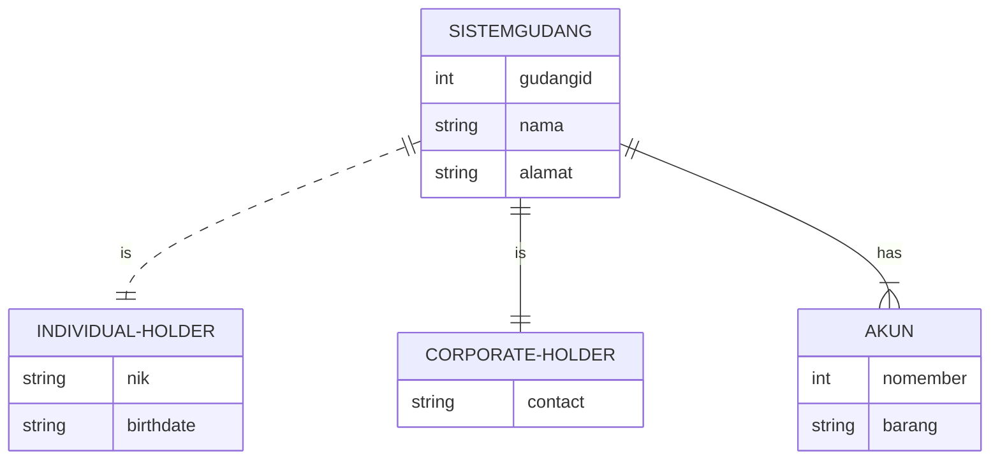
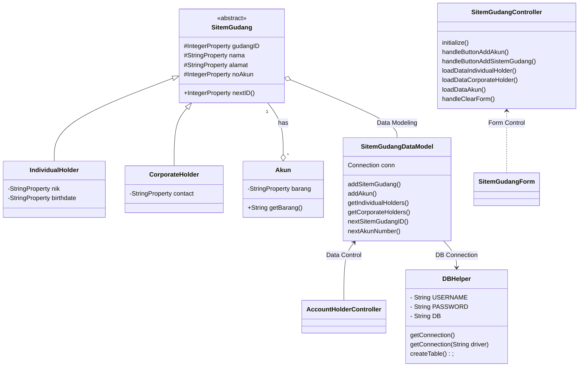

# SistemGudang

# KRISNA BENEDICTA PRIMA 1917051069 (Coding, Connection Database, GUI Form)

# AKHMAD ZULFIKAR 1957051013 (Desain ERD, Desain Database, Class Diagram)

# RAESHA SALSABILA 1957051006 (Coding, GUI Form, ERD Diagram)

# CLASS DIAGRAM

# ER DIAGRAM

# Design Class Diagram for JavaFX and Database

